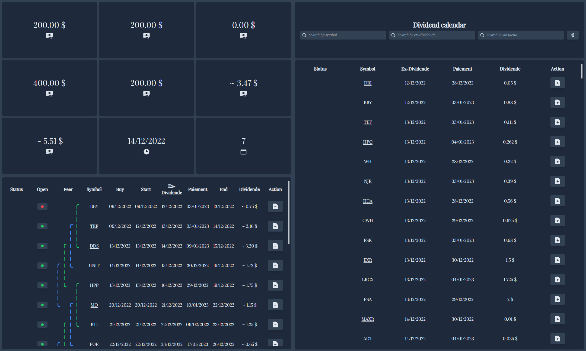

# app-KronosFinancial



## Structuration du projet

### `src`

#### `src/route`

_Inspired by the Nextjs 13 project_

<br/>
Each folder represents a route segment that maps to a URL segment. For example dashboard, stock
The folders in parenthesis will be omitted from the URL. For example (component), (store)
The folders in square bracket will be a dynamic segment. For example [id], [symbol]

```
/route
  /app                // url => 'https://.../app'
    /(lib)            // is not a part of the router
      /dayjs          // is not a part of the router
        index.ts
        ...
      /api            // is not a part of the router
        index.ts
        ...
    /(types)          // is not a part of the router
      index.ts
    /dashboard        // url => 'https://.../app/dashboard'
      /(components)   // is not a part of the router
        ...
      layout.tsx
    /stock            // url => 'https://.../app/stock'
      /[symbol]       // url => 'https://.../app/stock/[symbol]' => symbol is a params
        /(components)
          ...
        layout.tsx
      layout.tsx
    /dividend         // url => 'https://.../app/dividend'
      /[id]           // url => 'https://.../app/dividend/[id]' => id is a params
        index.tsx
    layout.tsx
  /web                // url => 'https://.../web'
    /login            // url => 'https://.../web/login'
    /home             // url => 'https://.../web/home'
```

Some additional rules on access permissions.

```
/route
  /app
    /(lib)
      /dayjs
        index.ts
        ...
      /api
        index.ts
        ...
    /dashboard
      /(components)
      layout.ts
    /stock
      /(components)
      /[symbol]
        /(components)
          ...
        layout.tsx      // is have access: (/(components)/*), is a don't have access: (../(components)/*)
      layout.tsx        // is have access: (/[symbol]/layout.tsx), is a don't have access: (/[symbol]/(components)/*)
    /dividend
      /[id]
        /(components)
          ...
        layout.tsx
      layout.tsx
    layout.tsx
  /web
    /login
    /home
```
